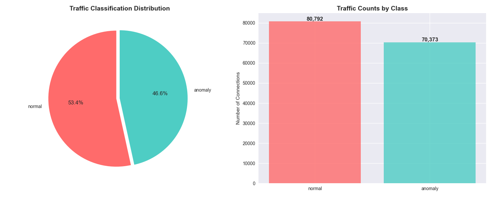

# Intrusion Detection System Using Machine Learning (NSL-KDD)

## Project Overview

This project develops a **machine learning-based Intrusion Detection System (IDS)** to classify network traffic as **normal** or **attack** using the **NSL-KDD dataset**. Leveraging a Random Forest classifier, the system achieves high accuracy in detecting cyber-attacks, making it a robust solution for cybersecurity applications such as anomaly detection, intrusion prevention, and network threat analysis.

The pipeline encompasses data loading, preprocessing, feature encoding, normalization, model training, evaluation, and visualization.

## Mathematical Foundation

### Feature Scaling

**Why Feature Scaling Matters**: To fully understand the necessity of feature scaling, consider that machine learning algorithms often compute distances or gradients. When features exist on vastly different scales (e.g., packet size in bytes vs. connection duration in seconds), the algorithm becomes biased toward larger-magnitude features, leading to suboptimal convergence.

**Z-score Normalization** transforms features to have zero mean and unit variance:

$$z = \frac{x - \mu}{\sigma}$$

- $x$: Individual data point
- $\mu$: Sample mean, computed as $\mu = \frac{1}{n}\sum_{i=1}^{n} x_i$
- $\sigma$: Sample standard deviation, $\sigma = \sqrt{\frac{1}{n-1}\sum_{i=1}^{n}(x_i - \mu)^2}$

**Mathematical Intuition**: This transformation creates a standardized distribution where $E[z] = 0$ and $\text{Var}(z) = 1$. The linear transformation preserves the relative distances between data points while ensuring all features contribute equally to distance-based computations.

**Linear Algebra Perspective**: For a feature matrix $\mathbf{X} \in \mathbb{R}^{n \times d}$, standardization can be expressed as:
$$\mathbf{Z} = (\mathbf{X} - \boldsymbol{\mu}^T) \cdot \text{diag}(\boldsymbol{\sigma}^{-1})$$
where $\boldsymbol{\mu}$ and $\boldsymbol{\sigma}$ are the mean and standard deviation vectors.

### Random Forest Classifier

**Ensemble Learning Principle**: To fully understand Random Forest's effectiveness, we must examine how it addresses the bias-variance tradeoff. Individual decision trees have low bias but high variance—they can perfectly fit training data but generalize poorly.

The Random Forest algorithm aggregates predictions from multiple decision trees:

$$\hat{y} = \text{MajorityVote}\left\{ h_1(x), h_2(x), \ldots, h_T(x) \right\}$$

- $h_t(x)$: Prediction from the $t$-th decision tree
- $T$: Number of trees (set to 100 in this implementation)

**Bootstrap Sampling**: Each tree trains on a bootstrap sample (sampling with replacement), introducing randomness that decorrelates the trees. This leverages the **Strong Law of Large Numbers** as $T \to \infty$, the ensemble average converges to the expected prediction.

**Feature Randomness**: At each split, only $\sqrt{d}$ features (where $d$ is total features) are considered, further reducing correlation between trees and improving generalization.

**Advantages for Intrusion Detection**:

- **Handles Mixed Data Types**: Can process both categorical (protocol type) and continuous (packet size) features without preprocessing
- **Robust to Outliers**: Tree-based splits are less sensitive to extreme values than linear models
- **Implicit Feature Selection**: Important features naturally appear more frequently in tree splits
- **Probability Estimates**: Provides confidence scores via the proportion of trees voting for each class

### Evaluation Metrics

Performance is evaluated using accuracy, precision, recall, F1-score, and AUC-ROC.

## System Architecture

The system is designed with a modular architecture for scalability and maintainability.

1. **Data Loading (`data_loader.py`)**: Efficiently ingests NSL-KDD dataset CSVs, leveraging **database** principles for file-based data management.
2. **Preprocessing (`preprocess.py`)**: Encodes categorical features and normalizes numerical data, applying **linear algebra** for matrix transformations.
3. **Model Training (`model.py`)**: Trains a Random Forest classifier, optimized with parallel processing (`n_jobs=-1`) for computational efficiency (**algorithms**).
4. **Visualization (`visualize.py`)**: Generates interactive plots (e.g., confusion matrix, ROC curve) to interpret results, using **statistics** for metric visualization.
5. **Pipeline Orchestration (`main.py`)**: Coordinates the workflow, ensuring modularity and reusability (**programming**, **theory of computation**).
6. **Prediction (`visualize.py`)**: Classifies new traffic samples, integrating preprocessing and model inference (**algorithms**).

## Technical Implementation

### Core Components

1. **Data Loader (`data_loader.py`)**:

   - Loads NSL-KDD dataset from CSV files.
   - Implements error handling for file existence, reflecting **database** management principles.

2. **Preprocessing (`preprocess.py`)**:

   - Applies **LabelEncoder** for categorical features and **StandardScaler** for numerical features.
   - Handles unseen categories in testing, showcasing robust **algorithmic** design.

3. **Model Training (`model.py`)**:

   - Trains a Random Forest classifier with 100 trees, optimized for performance.
   - Computes metrics (accuracy, precision, recall, F1-score) and saves the model using **joblib**.

4. **Visualization (`visualize.py`)**:

   - Produces interactive plots using **Matplotlib**, **Seaborn**, and **Plotly**:
     - Class distribution (pie and bar charts)
     - Missing values heatmap
     - Performance metrics dashboard
     - Confusion matrix heatmap
     - ROC curve
     - Feature importance
     - Prediction confidence

5. **Pipeline (`main.py`)**:
   - Orchestrates the workflow, integrating all modules.
   - Demonstrates **theory of computation** through structured control flow and modularity.

### Sample Features from NSL-KDD

| Feature          | Description                          | Type        |
| ---------------- | ------------------------------------ | ----------- |
| `duration`       | Connection duration                  | Numeric     |
| `protocol_type`  | Protocol (e.g., TCP, UDP, ICMP)      | Categorical |
| `service`        | Network service (e.g., http, telnet) | Categorical |
| `flag`           | Connection status flag               | Categorical |
| `src_bytes`      | Bytes sent from source               | Numeric     |
| `dst_bytes`      | Bytes sent to destination            | Numeric     |
| `land`           | 1 if source and destination are same | Binary      |
| `wrong_fragment` | Count of wrong fragments             | Numeric     |
| `urgent`         | Number of urgent packets             | Numeric     |
| `logged_in`      | 1 if login successful                | Binary      |
| `class`          | Target (normal or attack)            | Categorical |

## Academic and Practical Significance

### Cybersecurity Applications

- **Intrusion Detection**: Identifies threats like DoS, port scanning, and brute-force attacks.
- **Traffic Classification**: Flags suspicious network behavior for real-time monitoring.
- **SIEM Integration**: Enhances enterprise security systems with robust detection.
- **Policy Testing**: Evaluates firewall and IDS rule effectiveness.

### Demonstrated Competencies

- **Mathematics**:
  - **Linear Algebra**: Feature matrix transformations and scaling.
  - **Probability Theory**: Random Forest ensemble predictions and ROC curve analysis.
  - **Statistics**: Normalization, performance metrics, and data distribution analysis.
- **Programming Skills**: Python-based modular codebase with clean, reusable functions.
- **Algorithms and Data Structures**: Efficient preprocessing, tree-based classification, and feature importance ranking.
- **Databases**: File-based data management for NSL-KDD dataset ingestion.
- **Theory of Computation**: Structured pipeline with clear control flow and modularity.

## Installation and Usage

### Prerequisites

- Python 3.8+
- NSL-KDD dataset (`train.csv`, `test.csv`) in `data/` directory

### Setup Instructions

1. Clone the repository:

   ```bash
   git clone https://github.com/your-username/intrusion-detection-pipeline.git
   cd intrusion-detection-pipeline
   ```

2. Install dependencies:

   ```bash
   pip install -r requirements.txt
   ```

3. Place NSL-KDD dataset files in `data/` directory.

4. Run the pipeline:
   ```bash
   python src/main.py
   ```

## Visualizations

The pipeline generates interactive visualizations to interpret results, including:

- **Class Distribution**: Pie and bar charts showing normal vs. attack proportions.
- **Performance Metrics Dashboard**: Displays accuracy, precision, recall, and F1-score.
- **Confusion Matrix Heatmap**: Visualizes true vs. predicted labels.
- **Feature Importance**: Highlights top 20 influential features.
- **ROC Curve**: Plots true positive rate vs. false positive rate with AUC.

### Screenshots

Below are key visualizations from the pipeline, highlighting its analytical capabilities:

- **Training Data Analysis (`screenshots/training_data_anysis.png`)**: Includes pie and bar charts depicting the class distribution (normal vs. attack) in the training dataset. This visualization uses **statistics** to highlight data imbalance, a key consideration in designing robust intrusion detection systems.

  

- **Feature Importance (`models/feature_importance.png`)**: Displays the top 20 features contributing to the Random Forest classifier’s decisions, ranked by importance score. This visualization leverages **algorithms** to identify critical network traffic features, aiding in model interpretability and feature selection for cybersecurity applications.

  

- **Confusion Matrix (`models/confusion_matrix.png`)**: A heatmap illustrating true vs. predicted labels, with counts of true positives, false positives, true negatives, and false negatives. This uses **statistics** to quantify classification performance, critical for assessing the model’s effectiveness in intrusion detection.

  

- **ROC Curve (`models/roc_curve.png`)**: Plots the Receiver Operating Characteristic curve, showing the trade-off between true positive rate and false positive rate, with the Area Under the Curve (AUC) score. This visualization, grounded in **probability theory**, evaluates the model’s discriminative power.

  

## Project Structure

```
intrusion-detection-pipeline/
│
├── src/
│   ├── __init__.py
│   ├── data_loader.py        # Dataset loading logic
│   ├── preprocess.py         # Feature encoding and scaling
│   ├── model.py              # Model training and evaluation
│   ├── visualize.py          # Visualization functions
│   └── main.py               # Pipeline orchestration
├── data/
│   ├── train.csv             # NSL-KDD training dataset
│   └── test.csv              # NSL-KDD testing dataset
├── models/
│   └── intrusion_detection_model.pkl  # Trained model
├── screenshot.png
├── requirements.txt
└── README.md
```

## References

1. Tavallaee, M., Bagheri, E., Lu, W., & Ghorbani, A. A. (2009). _A Detailed Analysis of the KDD CUP 99 Data Set_. In _IEEE Symposium on Computational Intelligence for Security and Defense Applications (CISDA)_. DOI: 10.1109/CISDA.2009.5356528.
2. Dhanabal, L., & Shantharajah, S. P. (2015). _A Study on NSL-KDD Dataset for Intrusion Detection System Based on Classification Algorithms_. _International Journal of Advanced Research in Computer and Communication Engineering_, 4(6), 446-452.
3. Breiman, L. (2001). _Random Forests_. _Machine Learning_, 45(1), 5-32. DOI: 10.1023/A:1010933404324.
4. [NSL-KDD Dataset on Hugging Face](https://huggingface.co/datasets/Mireu-Lab/NSL-KDD).
5. [Scikit-learn: Random Forest Classifier](https://scikit-learn.org/stable/modules/generated/sklearn.ensemble.RandomForestClassifier.html).
6. [Scikit-learn: Model Evaluation Metrics](https://scikit-learn.org/stable/modules/model_evaluation.html).

## License

This project is licensed under the MIT License.
